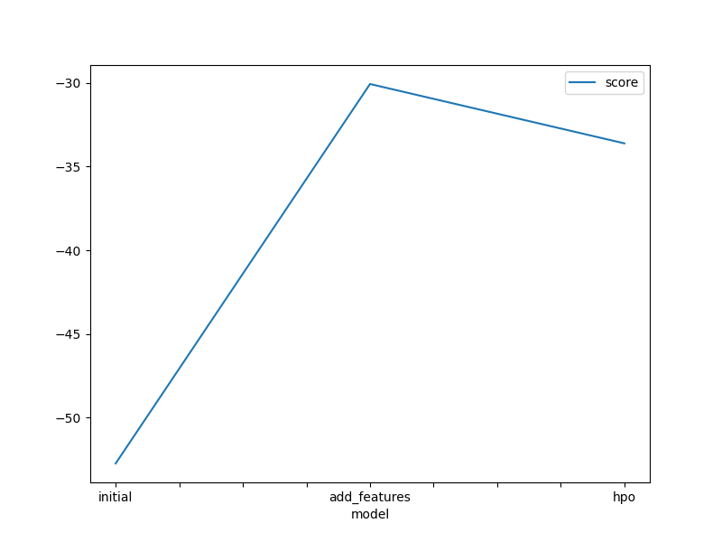
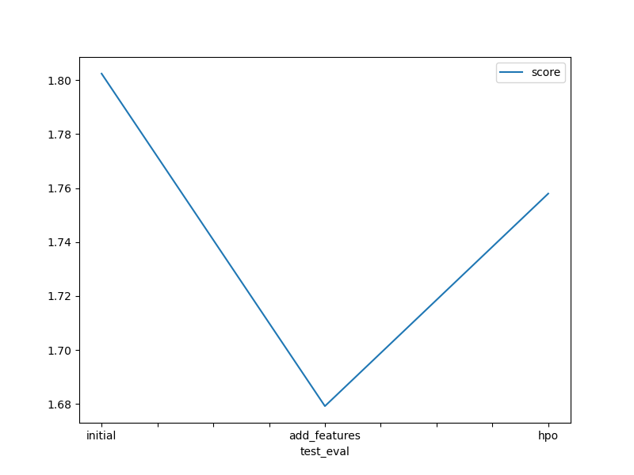

# Report: Predict Bike Sharing Demand with AutoGluon Solution
### Author : Yusuf Kerem Kezer

## Initial Training
### What did you realize when you tried to submit your predictions? What changes were needed to the output of the predictor to submit your results?
AutoMl is a very computationally expensive process model needs to be meticulously tuned
### What was the top ranked model that performed?
The Weighted Ensemble L3 model with new features performed best. This model combines many different models and takes a weighted average of the models. Each model captures different details. This approach provides better generalization and accuracy for the model.
## Exploratory data analysis and feature creation
### What did the exploratory analysis find and how did you add additional features?
Plotted the distribution of each feature and noticed some differences. For example, since more bikes are shared during rush hour, we separated these hours categorically.
### How much better did your model preform after adding additional features and why do you think that is?
The model score improved by 6.83% with new features, Because with additional features we provided more information to the model.
## Hyperparameter tuning
### How much better did your model preform after trying different hyperparameters?
Different hyperparameters on the model with new features, the model deteriorated by 4.69%

### If you were given more time with this dataset, where do you think you would spend more time?
I would tend to searching better tuned model because I think the model wasn't tuned effectively. Secondly I would focus on maybe more feature engineering because there could be more information under the hood. I think these two steps are really important.

### Create a table with the models you ran, the hyperparameters modified, and the kaggle score.
|model|hpo1|hpo2|hpo3|score|
|--|--|--|--|--|
|initial|time_limit=300|presets=best_quality|GBM:num_boost_round: 100|1.80244|
|add_features|time_limit=300|presets=best_quality|RF:n_estimators: 100|1.67918|
|hpo|time_limit=300|presets=best_quality|CAT:iterations: 100|1.75797|

pd.DataFrame({
    "hpo1": ['time_limit=300', 'presets=best_quality', '"GBM":"num_boost_round": 100'],
    "hpo2": ['time_limit=300', 'presets=best_quality', '"RF:"n_estimators": 100'],
    "hpo3": ['time_limit=300', 'presets=best_quality', '"CAT:"iterations": 100"'],
    "score": [1.80244, 1.67918, 1.75797]
})

### Create a line plot showing the top model score for the three (or more) training runs during the project.

### Create a line plot showing the top kaggle score for the three (or more) prediction submissions during the project.

## Summary

We tested Autogluon 3 different model 

Weighted Ensemble L3 algorithm performed best for all models.This algorithm combines many different algorithms and takes a weighted average of them.

First model: with no optimization no feature engineering
Second model: we added some features like  year, month, day, hour,rush_hour,humidity_category,temp_category,windspeed_category
Third model: we tried to train the model with some hyperparameters

Lastly we plotted models scores to understand what is the effect of each model
While Feature added model performed 6.83% better than initial model,Hyperparameter tuned model performed 4.69% worse than the feature-added model.
As a result, adding new features can have a big impact, but hyperparameter tuning is a more experimental process and generally requires more time to tune efficiently.
